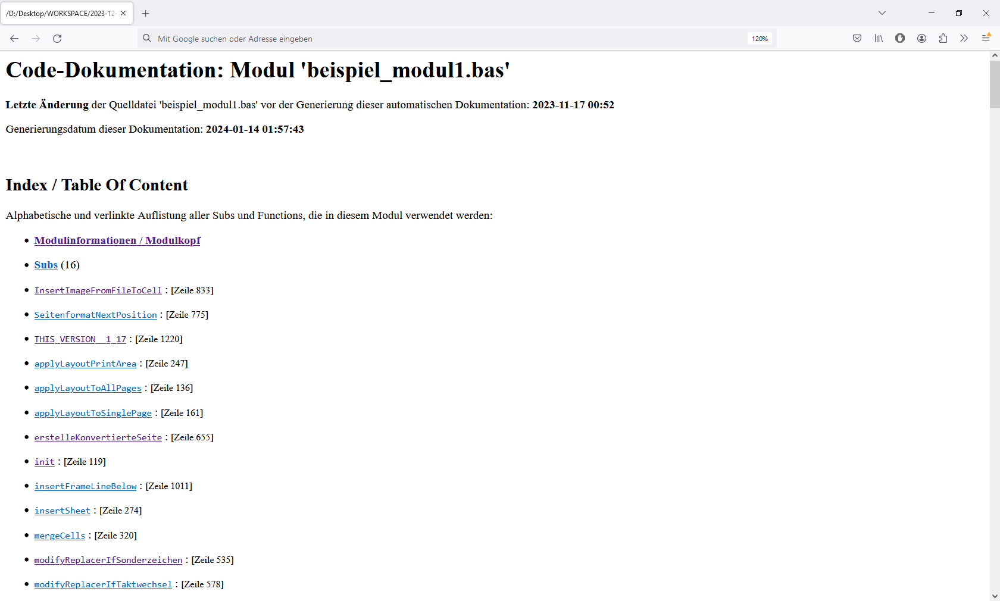
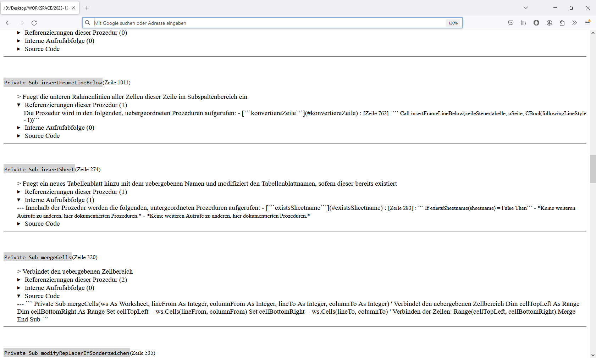
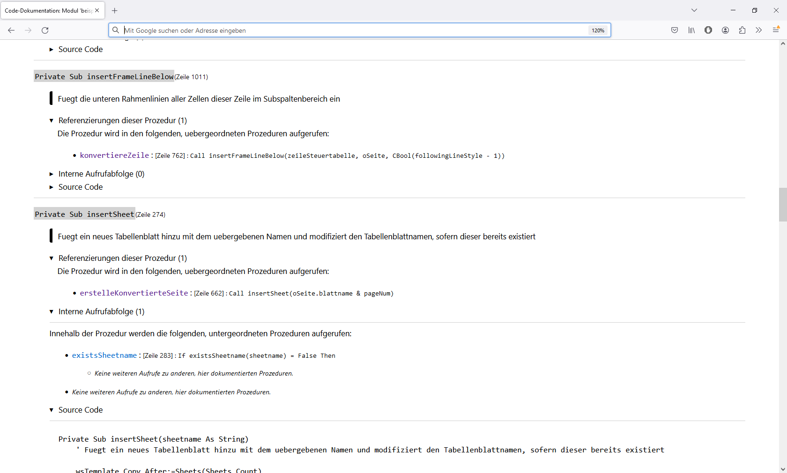

# Code Documentation Generator (especially for functional-programming structures)

> This Readme will not be updated anymore since all further stuff will be written in English. Until this point everything was German, so here is the last version from 19.02.2024 in German.

-----

-----

>  Tool to automatically generate a documentation of the source code - mainly used for function-based flows (currently only supporting single VBA-moduls, support for Python and C++ shall follow).

> **Unlinke many other generic documentation tools this project focus on the documentation of code with a functional-programming approach rather than a class-based approach.** Aim is to show the flow (calls of other procedures) within the procedures.

For a quick first impression of the result, see the screenshots in below ([Output-Ergebnis, nach Umwandlung von MD- in HTML-Datei:](#output-ergebnis-nach-umwandlung-von-md--in-html-datei))

> As I started this project privatly and was not very forward-looking a lot of the text (readme + code comments) is written in **German**. Step by step I will change this and translate everything to have a continuous language - sorry for that.

---

> Hilfsmittel, um automatisiert eine Dokumentation von Quellcode zu generieren

 

Basierend auf Textdateien mit Quellcode wird durch die Anwendung eine Dokumentation dieses Quellcodes erstellt.

<h1> Inhalt:</h1>

- [Code Documentation Generator (especially for functional-programming structures)](#code-documentation-generator-especially-for-functional-programming-structures)
- [Main Advantages in contrast to other tools](#main-advantages-in-contrast-to-other-tools)
- [Zusammenfassung und Ziel des Projektes](#zusammenfassung-und-ziel-des-projektes)
- [Voraussetzungen zur Anwendung](#voraussetzungen-zur-anwendung)
  - [NOTE: Conventions / Konventionen:](#note-conventions--konventionen)
- [Bedienungshinweise / Workflow der Anwendung](#bedienungshinweise--workflow-der-anwendung)
- [Inhalte der generischen Dokumentation](#inhalte-der-generischen-dokumentation)
  - [Anzeige einer Übersicht über das Modul](#anzeige-einer-übersicht-über-das-modul)
  - [Anzeige der Dokumentation aller Prozeduren](#anzeige-der-dokumentation-aller-prozeduren)
    - [Anzeige einer Übersicht über die Prozedur](#anzeige-einer-übersicht-über-die-prozedur)
    - [Anzeige von Referenzierungen dieser Prozedur](#anzeige-von-referenzierungen-dieser-prozedur)
    - [Anzeige von interner Aufrufabfolge](#anzeige-von-interner-aufrufabfolge)
    - [Anzeige des Quellcodes](#anzeige-des-quellcodes)
  - [Anzeige der Schlussbemerkungen](#anzeige-der-schlussbemerkungen)
- [Screenshots von Bedienung und Ergebnis der Anwendung](#screenshots-von-bedienung-und-ergebnis-der-anwendung)
  - [GUI zur Parametrisierung und Steuerung des Workflows:](#gui-zur-parametrisierung-und-steuerung-des-workflows)
  - [Output-Ergebnis, nach Umwandlung von MD- in HTML-Datei:](#output-ergebnis-nach-umwandlung-von-md--in-html-datei)
    - [Generierter Seitenanfang:](#generierter-seitenanfang)
    - [Generierte Dokumentation von Prozeduren:](#generierte-dokumentation-von-prozeduren)
    - [Generierte Dokumentation von Prozeduren:](#generierte-dokumentation-von-prozeduren-1)
    - [Generiertes Seitenende:](#generiertes-seitenende)
- [Ausblick / mögliche Weiterentwicklungen](#ausblick--mögliche-weiterentwicklungen)
- [OBSOLET  /  ALT:  Alte Dokumentation aus den Ansätzen](#obsolet----alt--alte-dokumentation-aus-den-ansätzen)
- [Möglicher Programmablauf zur Dokumentierung von VBA-Code](#möglicher-programmablauf-zur-dokumentierung-von-vba-code)
- [Grundsätzliche Basis-Struktur zur Generierung erster Ergebnisse](#grundsätzliche-basis-struktur-zur-generierung-erster-ergebnisse)
- [Inhalte der einzelnen Prozeduren identifizieren und dokumentieren](#inhalte-der-einzelnen-prozeduren-identifizieren-und-dokumentieren)
- [Aufrufe / Referenzierungen der Prozeduren](#aufrufe--referenzierungen-der-prozeduren)
- [Call Sequenz / Calling Sequence](#call-sequenz--calling-sequence)
- [Abschlussgedanke - wichtig vor dem Start](#abschlussgedanke---wichtig-vor-dem-start)

# Main Advantages in contrast to other tools 

- for function based codes as the internal flow of calls is documented

- shall support multiple programming languages (vba, c++, python) - currently only vba is supported...

# Zusammenfassung und Ziel des Projektes

Um bei umfangreicheren Quellcode-Dateien den Überblick über die Inhalte und Abläufe innerhalb dieser Module zu behalten, ist eine Dokumentation sehr sinnvoll bzw. notwendig. Um den Aufwand zur Erstellung hiervon möglichst gering zu halten, kann mit diesem Code-Documentation-Generator automatisiert eine solche Dokumentation erfolgen. Zu den Bestandteilen der Dokumentation gehört eine Beschreibung/Erklärung der einzelnen Prozeduren, die bereits im Quellcode implementiert sein muss (Docstring). Zusätzlich hierzu werden alle Referenzierungen der einzelner Prozeduren detailliert aufgelistet, sodass Zusammenhänge zwischen den einzelnen Prozeduren deutlich werden.
Außerdem wird der Ablauf von Aufrufen innerhalb jeder Prozedur analysiert und dokumentiert, was letztendlich eine Übersicht des  groben Gesamt-Ablaufes des zu analysierenden Codes darstellt.
Um im Einzelfall auch genauere Fragestellungen zu beantworten, wird zusätzlich auch der Quellcode selbst von jeder Prozedur dokumentiert.

Die Anwendung erfolgt intuitiv über eine GUI, die alle erforderlichen Eingaben abfragt, und über die der Programmablauf gesteuert wird.

# Voraussetzungen zur Anwendung

- Aktuell ausschließlich VBA-Code
- Aktuell kann immer nur ein einziges VBA-Modul dokumentiert werden. Dependencies zu anderen Modulen werden nicht berücksichtigt (z. B. würde bei der Dokumentation des Moduls "Modul1.bas" ein Aufruf der Prozedur `Modul2.Procedure1` nicht als Prozedur-Aufruf berücksichtigt werden, gleichzeitig würde diese Referenzierung dieser Prozedur bei der Dokumentation von Modul2.bas" nicht berücksichtigt werden.)

## NOTE: Conventions / Konventionen:

> **Docstring-Konvention speziell für die Programmiersprache VBA:** Als DocString einer Prozedur werden alle auskommentierten Zeilen gewertet, die direkt (ohne Leerzeile) unter der Deklarationszeile einer Prozedur stehen. Der Docstring wird als beendet angesehen, sobald eine Leerzeile folgt, oder eine Zeile, die nicht auskommentiert ist.

> To generate a docstring from the VBA-Source make sure that the text to shown is located directly below the declaration line of the procedure. The text is considered completed with the first following line in the code which is not an entire comment line. Empty lines that are to be included must also be labelled as comments.

# Bedienungshinweise / Workflow der Anwendung

Um eine korrekte Dokumentation zu generieren, muss sichergestellt werden, dass innerhalb der zu dokumentierenden Datei die erforderlichen Konventionen eingehalten werden (siehe Voraussetzungen zur Anwendung).

1. Starten der Anwendung
2. Parametrisierung der vorzunehmenden Dokumentation innerhalb einer GUI:
   1. Auswahl der zu dokumentierenden Textdatei (".bas")
   2. Auswahl des Zielverzeichnisses, in dem die zu generierende Dokumentation (".md") gespeichert werden soll
   3. Auswahl, ob die zu erstellende .md-Datei in eine HTML umgewandelt werden soll
   4. Auswahl bzgl. Ausgabe-Details in der Dokumentation
3. Starten der Generierung
4. (Kurze Wartezeit)
5. Schließen der Abschlussmeldung
6. [OPTIONAL]:  Zur manuellen Konvertierung der erstellten Markdown-Datei in eine HTML-Datei wird die Extension 'Markdown All in One' für  VSCode empfohlen, da hierüber eine Konvertierung erfolgt, die für eine ordentliche Formatierung der Code-Segmente in den generierten HTML-Dateien sorgt (siehe Vergleichs-Screenshots unter [Screenshots](#screenshots-von-bedienung-und-ergebnis-der-anwendung)).

# Inhalte der generischen Dokumentation

Alle Inhalte sind in der erstellten HTML-Datei interaktiv miteinander verlinkt.

## Anzeige einer Übersicht über das Modul
- Titel mit Dateinamen der Quelldatei
- Organisatorische Daten:
  - Zeitstempel der Generierung der Dokumentation
  - Zeitstempel der letzten Änderung der Quelldatei
- Inhaltsverzeichnis
- Modulinformationen / Modulkopf / DocString des Moduls

## Anzeige der Dokumentation aller Prozeduren

Es werden in einer Section zunächst alle einzelnen Subs, in einer weiteren Section dann alle einzelnen Functions dokumentiert, wobei die Dokumentation einer einzelnen Prozedur wie folgt aufgebaut ist:

### Anzeige einer Übersicht über die Prozedur
- Modifier, Name und Zeilennummer der Deklarierungszeile
- DocString der Prozedur (definiert als die Kommentare direkt unterhalb der Deklarationszeile ohne Leerzeile)

### Anzeige von Referenzierungen dieser Prozedur

> Zeigt, wo diese Prozedur an anderen Stellen verwendet und aufgerufen wird.

- Anzahl an Referenzierungen
- Für jede Referenzierung: 
  - Name der aufrufenden (übergeordneten) Prozedur
  - Zeilennummer des Aufrufes
  - Gesamter Code dieser Zeile, sodass Aufrufparameter dokumentiert werden

### Anzeige von interner Aufrufabfolge

> Zeigt die Reihenfolge aller Aufrufe von anderen Prozeduren in einer Prozedur. (dabei werden aber nur solche Prozeduren berücksichtigt, die in dieser Dokumentation selbst dokumentiert werden)

- Anzahl an Einträgen für die Aufrufe anderer Prozeduren
- Für jeden Aufruf einer anderen Prozedur: 
  - Name dieser aufgerufenen Prozedur
  - Zeilennummer des Aufrufes
  - Gesamter Code dieser Zeile, sodass Aufrufparameter dokumentiert werden
  - sofern es innerhalb der aufgerufenen Prozedur weitere Aufrufe erfolgen, werden diese im gleichen Muster jeweils eingerückt gelistet, und dies bis dass zuletzt eine Prozedur gelistet wird, in der keine weiteren Aufrufe erfolgen.

### Anzeige des Quellcodes

> Zeigt den gesamten Quellcode der Prozedur an

- in der erstellten HTML-Datei kann dieser Teil interaktiv verborgen / angezeigt werden (collapse/expand), da der Quellcode normalerweise nicht zur Dokumentation desselben gehört.

## Anzeige der Schlussbemerkungen

Am Seitenende werden Hinweise darauf gegeben, dass es sich bei der Dokumentation um eine generische Dokumentation handelt.

Aktuell wird zusätzlich noch als Collapsed-Segment der DocString des Python-Moduls des Code-Generator-Scriptes dokumentiert, durch das die Umwandlung erfolgte.

Außerdem wird die aktuelle Version bzw. das aktuelle Commit dieses Scriptes dokumentiert.

# Screenshots von Bedienung und Ergebnis der Anwendung

## GUI zur Parametrisierung und Steuerung des Workflows:

## Output-Ergebnis, nach Umwandlung von MD- in HTML-Datei:

### Generierter Seitenanfang:

Nutzung der **automatischen Konvertierung** MD --> HTML:

Nutzung der **manuellen Konvertierung** MD --> HTML:

### Generierte Dokumentation von Prozeduren:

Nutzung der **automatischen Konvertierung** MD --> HTML:

Nutzung der **manuellen Konvertierung** MD --> HTML:

### Generierte Dokumentation von Prozeduren:

Nutzung der **automatischen Konvertierung** MD --> HTML:

Nutzung der **manuellen Konvertierung** MD --> HTML:

### Generiertes Seitenende:

Nutzung der **automatischen Konvertierung** MD --> HTML:

Nutzung der **manuellen Konvertierung** MD --> HTML:

# Ausblick / mögliche Weiterentwicklungen

- Zusatzmöglichkeit in GUI einen benutzerdefinierten Text einzugeben (Prio sehr gering!!). Dieser würde dann in der Dokumentation in einer eigenen Section angezeigt werden.

- Index an der Seite der HTML-Seite einfügen wie eine NavBar zum einzelnd scrollen

- Ermöglichung von Berücksichtigung weiterer Module innerhalb der Dokumentation
    
    - z. B. 2 VBA-Module innerhalb eines Projektes, wobei Prozeduren von Modul1  andere Prozeduren aus Modul2 aufrufen.

        - Erstmal nur als Verweis  (Mögl. Ansatz included = "Modul1.*" ohne rekursive Auflistung derer Aufrufe... oder eben mit... bestenfalls auch das parametrisierbar)

- Dokumentation von weiteren PRogrammiersprachen

    - OK --> VBA
    - Nächste Prio: C++ / Arduino
    - Letzte Prio: Python (v.a. für den Ablaufsequence sehr hilfreich, für den rest gibt es pdoc...)

<!-- 

# OBSOLET  /  ALT:  Alte Dokumentation aus den Ansätzen

(old approaches) 

> Inzwischen größtenteils obsolet, ggf. auch nicht (mehr) korrekt

# Möglicher Programmablauf zur Dokumentierung von VBA-Code

Abarbeiten mit Python, v.a. unter Nutzung von regulärer Ausdrücke (regex, package re)

Hier ein beispielhafter, möglicher Programmablauf

# Grundsätzliche Basis-Struktur zur Generierung erster Ergebnisse

1. Einfache GUI zur Auswahl der Quell-Datei(en)  und Ziel-Speicherorte
1. .bas-Textdatei einlesen
2. Regex-Suche nach sämtlichen Subs, die NICHT auskommentiert sind. Zeilennummern werden gespeichert in Liste
2. Regex-Suche nach sämtlichen Functions, die NICHT auskommentiert sind. Zeilennummern werden gespeichert in Liste.
3. Auflistung aller gefundener Subs in der Kategorie Subs unter Angabe von Namen, ggf. auch von Zeilennummern zusätzlich, und Scope (Private / public...)
3. Auflistung aller gefundener Functions in der Kategorie Functions unter Angabe von Namen, ggf. auch von Zeilennummern zusätzlich, und Scope (Private / public...)

Beim Auflisten wird jeweils eine template verwendet (vgl. Code-Generator / PAP-Designer), sodass mit Platzhaltern gearbeitet werden kann. Es wird ein Anker gesetzt, sodass zusätzlich ein Inhaltsverzeichnis am Ende erstellt werden kann.

Damit hätte man mit relativ wenig Aufwand eine Auflistung aller verfügbarer Subs + Functions als Dokumentation inkl. Index. Was dann noch fehlt, sind die Details zu diesen einzelnen Prozeduren.

# Inhalte der einzelnen Prozeduren identifizieren und dokumentieren

Vorgehensweise dann ist relativ easy, sofern doppelte Arbeit okay wäre - und das ist es:
* Verbinde Listen der Zeilennummern der einzelnen Subs und Functions zu einer großen Liste, unabhängig von Art der Prozedur
* Sortiere diese Liste aufsteigend

Dann ist klar, von welcher Zeile bis zu welcher Zeile jeweils die Prozedur im Quellcode steht. Die Abzüge aufgrund von langen auskommentierten Zeilen oder Leertasten (oder auch nicht verwendeter Prozeduren) erfolgen später

WEitere Vorgehensweise:
1) Extrahiere den Text ab Startzeile einre Prozedur bis zur Startzeile - 1 der nächsten Prozedur
2) Fange von hinten an: Suche von hinten die erste Zeile, in der wirklich Code-Relevantes steht (keine Leerzeilen, kein ausschließliche Kommentarzeile)
3) Von dieser Zeile dann wiederum vorwärts richtung hinten: Sofern diese Zeile + 1 leer ist: Lösche alles dahinter bis zum Ende dieser Prozedur. (Hintergrund: Nach einem Code-Befehl darf noch eine Zeile Kommentar stehen, aber nicht 100 Zeilen kOmmentar + leerzeilen, das könnte nämlcih einfach eine veraltete und nciht mehr gebrauchte, auskommentierte anderer Methode sein...)
4) Damit ist die Startzeile und Endzeile geklärt
5) Als nächsts wird geschaut, ob in Zeile 1 unterhalb der Deklarierung ein Kommentar steht. Falls ja: Werte sie als Docstring. Falls nein (code ODR leezeile: kein Beschreibung vorhanden!).Falls Docstring gewertet wurde: Suche auch in allen folgenden Zeilen danach und erweiterer den docstring, bis dass ein eLeerzeile ODRE eine nicht komplett auskommentierte Zeile gefunden wird.
6) Damit ist auch die Beschreibung verfügbar, die in die Template eingefügt werden kann
7) ebenfalls verfügbar sind hierdurch nun die Zeilennummern, von und bis, in der die Prozedur stattfndt. Dies kann ebenfalls in die Template gesetzt werden.

# Aufrufe / Referenzierungen der Prozeduren
Es fehlt nur noch die liste der Aufrufe der Prozedur.
Hierzu: Durchsuche den gesamten Quelltext nach einem Regex-Muster, der einen NICHT-AUSKOMMENTIERTEN Aufruf der entsprechenden Prozedur hat. 
Extrahiere die Zeile hieraus, und die aufrufende Prozedur (dies ist über Vergleich zwischen ZEilennummern und der Zeilennummernlisten möglich), dann kann auch noch der klartext aufgeschrieben werden.

# Call Sequenz / Calling Sequence

Schön (Ausblick) wäre auch ein weiterer Unterpunkt pro Prozedur, in der die Aufrufabfolge hervorgeht.
Idee ist etwas wie die Aufrufebenen-Auflistung beim Noten-Converter-Programm, d.h. ausgehend von einer Prozedur soll eine Liste stehen der Aufrufe von weiteren Prozeduren die aufgerufen werden (und die in diesem Dokument auch dokumentiert werden... also keine Builtins o.ä.). Im Idealfall kann jeder Punkt dieser Liste wiederum erweitert/expanded werden, darin ist dann wiederum die Liste von DIESER AUFGERUFENEN Funktion drin usw... Rekursiv. Jede Methode, die einmal so dokumentiert wurde kann weiter verwendet werden per Direktzugriff....

# Abschlussgedanke - wichtig vor dem Start
Der Ablauf des Programmes wäre auch ähnlich, wenn statt VBA eine andere PRogrammiersprache  dokumentiert werden sollte.  Lediglich die KEywords und Strukturen der zu dokumentierenden Programmierug weichen ab, dementsprechend müssten andere Regex-Mustern verwendet werden. Etwas komplizierter wäre das, wenn die Sprachen stark von voneinander abweichen, oder falls verschiedene Symbole gleiche Bedeutungen haben (z. B. die verschiednenen String-Einleiter bei Python ' oder "). Trotzdem sollte vor Beginn der Arbeit zumindest überlegt werden, in wie weit es sinnvoll oder möglich wäre, das Programm so aufzubauen, dass es ggf. auf verschiedene PRogrammiersprachen erweitert werden könnte.

Das Python-Modul pdoc liefert zwar ohne eigene Programmierung eine ausgereifte, sehr übersichtliche, gut druckbare und interaktive Übersicht von Python-Modulen, allerdings gehen Referenzierungen der einzelnen PRozeduren nicht aus dieser Dokumentation hervor.
Ein Alternativer Ansatz wäre, obo man das o.g. Zusatzmodul selbst anpassen und erweitern könnte durch solche Funktionalitäten.

Relevant wäre eine solche Dokumentationsmöglichkeiten für die folgenden Programmiersprachen:
* VBA
* PYthon
* C++ (µC) 
