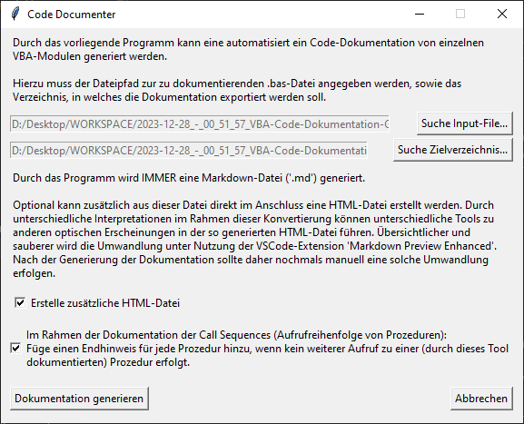
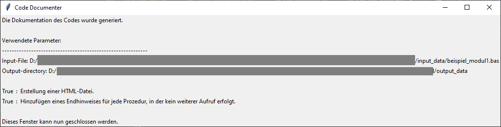
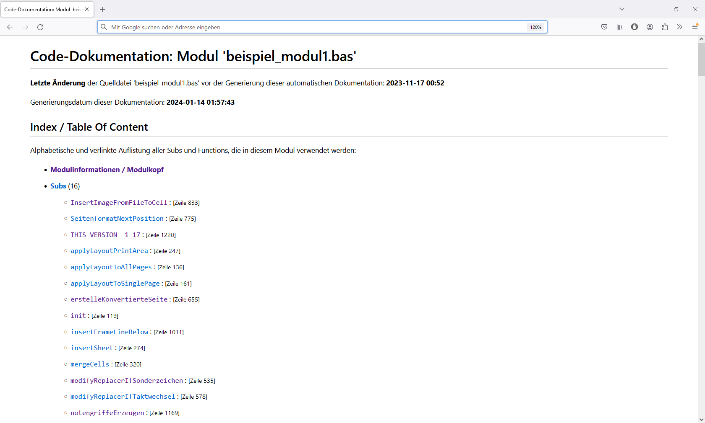
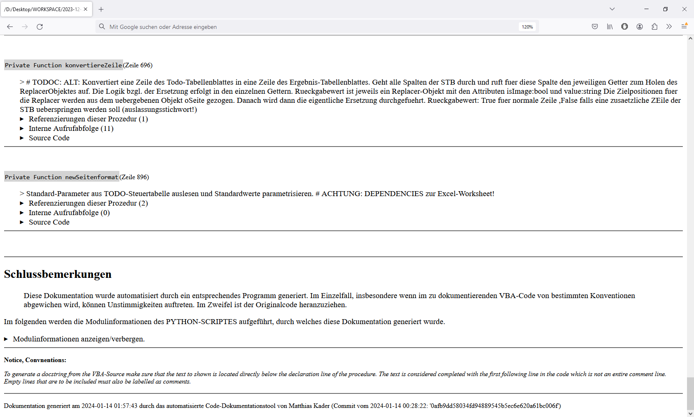
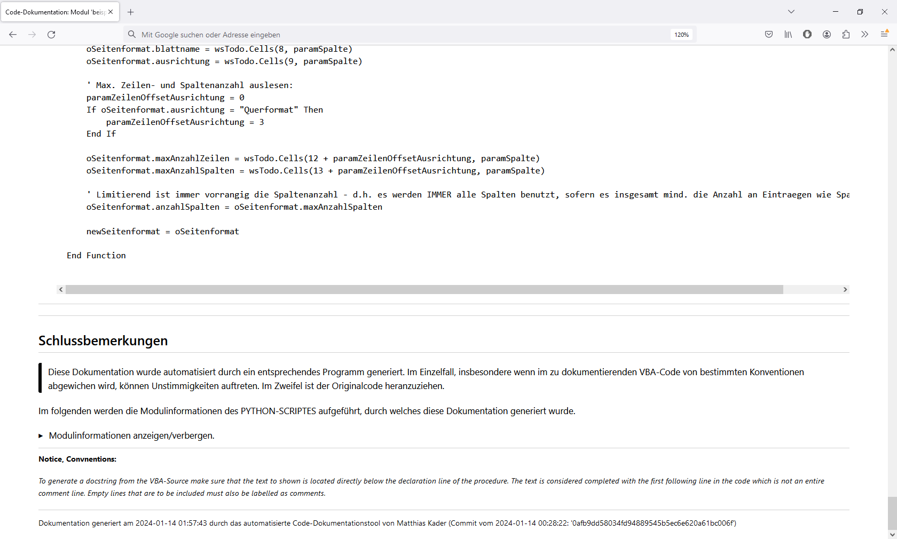

# Code Documentation Generator (especially for functional-programming structures)

>  Tool to automatically generate a documentation of the source code - mainly used for function-based flows (currently only supporting single VBA-moduls, support for Python and C++ shall follow).

> **Unlinke many other generic documentation tools this project focus on the documentation of code with a functional-programming approach rather than a class-based approach.** Aim is to **show the program schedule (flow / calls of other procedures)** within the procedures.

**&#9888; As this project was not meant to become a public one in the first place, I did not chore and tidy the code by now! Also I began in German, but I will fix those both issues step by step and while choring I will translate everything in the code :-) =====>>> I am currently working on this translation - see branch *'translate_to_english'***

For a quick first impression of the result, see the screenshots in below [Screenshots of operation and generated output files](#screenshots-of-operation-and-generated-output-files)

> **NOTE:** As I started this project privatly and was not very forward-looking a lot of the text (readme + code comments) is written in **German**. Step by step I will change this and translate everything to have a continuous language - sorry for that. 
> 
>
> The original [**German Readme**](<readme (German - state of 2024-02-19).md>)  will be untoucht in the future but will still remains as reference with the current status as of 2024-02-19 for checking translation issues.
> ***
>  > **I am currently working on the translation of the entire code project - see also branch** *'translate_to_english'*
> ***
> **&#9888; If there is anything unclear or poor translated - feel free to correct it or to ask (e.g. via a new issue?) for the meaning...**

---

Based on the actual text files with source code, the application creates a documentation of this source code.

<h1> Table Of Content:</h1>

- [Code Documentation Generator (especially for functional-programming structures)](#code-documentation-generator-especially-for-functional-programming-structures)
- [Main Advantages in contrast to other tools](#main-advantages-in-contrast-to-other-tools)
- [Summary and aim of the project](#summary-and-aim-of-the-project)
- [Prerequisites](#prerequisites)
  - [Preparation to execute the script](#preparation-to-execute-the-script)
  - [Preparation of the text file(s) which contains the source code to be documented (input-data)](#preparation-of-the-text-files-which-contains-the-source-code-to-be-documented-input-data)
- [Operating instructions / Workflow of the Usage of the application](#operating-instructions--workflow-of-the-usage-of-the-application)
- [Contents of the generic documentation - This is what you will get:](#contents-of-the-generic-documentation---this-is-what-you-will-get)
  - [Display an overview of the module](#display-an-overview-of-the-module)
  - [Display the documentation of each of the procedures](#display-the-documentation-of-each-of-the-procedures)
    - [Display an overview of the procedure](#display-an-overview-of-the-procedure)
    - [Display of references of this procedure](#display-of-references-of-this-procedure)
    - [Display of internal call sequence](#display-of-internal-call-sequence)
    - [Display of the source code](#display-of-the-source-code)
  - [Display of closing remarks](#display-of-closing-remarks)
- [Screenshots of operation and generated output files](#screenshots-of-operation-and-generated-output-files)
  - [GUI for parameterization and control of the workflow:](#gui-for-parameterization-and-control-of-the-workflow)
  - [Output result, after conversion from MD file to HTML file:](#output-result-after-conversion-from-md-file-to-html-file)
    - [Generated top of page:](#generated-top-of-page)
    - [Generated documentation of procedures](#generated-documentation-of-procedures)
    - [Generated end of page](#generated-end-of-page)
- [Forecast /  possible further developments](#forecast---possible-further-developments)

# Main Advantages in contrast to other tools 

- for function based codes as the internal flow of calls is documented

- shall support multiple programming languages (vba, c++, python) - currently only vba is supported...

# Summary and aim of the project

In order to maintain an overview of the content and processes within these modules for larger source code files, documentation is very useful and necessary. In order to minimize the effort required to create this documentation, this code documentation generator can be used to create such documentation automatically. The documentation includes a description/explanation of the individual procedures, which must already be implemented in the source code (as docstrings or docstring-like comment, see conventions below). In addition to that, **all references to the individual procedures are listed in detail, so that  the connections between the individual procedures become obvious**.
**The sequence of calls (flow) within each procedure is also analyzed and documented, which ultimately provides an overview of the rough overall sequence of the code to be analyzed**.
In order to answer more precise questions in individual cases, the source code itself of each procedure is also documented in an expandable area.

The application provides an intuitively handling via GUI, which queries all necessary inputs from the user and controls the program flow.

> **Unlinke many other generic documentation tools this project focus on the documentation of code with a functional-programming approach rather than a class-based approach.** Aim is to show the program schedule (flow) (calls of other procedures) within the procedures. For mainly class-based programms available tools like pdoc (as an example for python programming language) will be the better choice.

# Prerequisites

## Preparation to execute the script

 **&#9888;... # TODO: ... `pip install requirements.txt` - ??? currently the file is missing!!! But you don't need much as most of the logic is just searching through text...... ()**

## Preparation of the text file(s) which contains the source code to be documented (input-data)

- Currently supported input source code:
  - only VBA 
  - (aim is to expand the tool for Python and C++)
- Currently, only one single text file with code can be documented at a time (only a single module). Dependencies to other modules are not taken into account (e.g. in the documentation of the module "Module1.bas", a call of the procedure "Module2.Procedure1" would not be taken into account as a procedure call, at the same time this referencing of this procedure would not be taken into account in the documentation of "Module2.bas").

  **&#9888; Poor translation...  Please correct if you get the content...**

- The description of each procedure will be generated by using the docstring below the declaration line in the code - if there is a docstring provided (so make sure it is...)

- Relevant conventions for documenting VBA:

    > **Docstring convention specifically for the VBA programming language:** 
    > 
    > As there is no specific syntax for multiline comments in VBA (as for docstrings in python) here will be introduced following convention: 
    >
    > To generate a docstring from the VBA-Source make sure that the text to be displayed is located directly below the declaration line of the procedure. The text of this docstring  is considered completed with the first following line in the code which is not an entire comment line. Empty lines that are to be included must also be labelled as comments.

# Operating instructions / Workflow of the Usage of the application

In order to generate correct documentation, it must be ensured that the required conventions are adhered to within the file to be documented (see Prerequisites above).

1. start the script via navigate to source directory in the terminal and prompt `python code_documenter.py`
2. Use the GUI to parameterize  the output which will be generated:
   
   2.1. selection of the (input-) text file to be documented *(currently only ".bas")*

   2.1. selection of the target directory in which the documentation to be generated (".md") is to be saved
   
   2.2. selection of wheather the .md file to be created should be converted to HTML afterwards
   
   2.3. selection regarding output details in the documentation

3. start the generation

4. (short waiting time)
   
5. close the final message

6. *[OPTIONAL]*:  The 'Markdown All in One' extension for VSCode is recommended for manual conversion of the generated Markdown file into an HTML file, as this provides a conversion that ensures proper formatting of the code segments in the generated HTML files (see comparison screenshots under [Screenshots](#screenshots-of-operation-and-result-of-application)).

# Contents of the generic documentation - This is what you will get:

*All content in the generated output MD and HTML file is interactively linked.*

## Display an overview of the module

- Title with file name of the source file
- Organizational data:
  - Timestamp of the generation of the documentation
  - Timestamp of the last change to the source file
- Table of contents
- Module information / module header / DocString of the module

## Display the documentation of each of the procedures

All individual subs are first documented in one section and then all individual functions in another section, whereby the documentation of an individual procedure is structured as follows:

### Display an overview of the procedure

- Modifier, name and line number of the declaration line
- DocString of the procedure *(defined as the comments directly below the declaration line without a blank line)*

### Display of references of this procedure

> Shows where this procedure is used and called in other places.

- Total counts of references
- For each referencing: 
  - Name of the calling (parent) procedure
  - Line number of the call
  - Complete code of this line, so that call parameters are documented

### Display of internal call sequence

> Shows the sequence of all calls of other procedures in a procedure. (only those procedures that are documented in this documentation itself are taken into account) *(Actually this is the inverse/reverse for the references of the procedures...)*

- Total counts of entries for the calls of other procedures
- For each call of another procedure: 
  - Name of this called procedure
  - Line number of the call
  - Entire code of this line, so that call parameters are documented
  - if there are further calls within the called procedure, these are listed indented in the same pattern until the last procedure is listed in which no further calls are made. *(see Screenshots below...)*

### Display of the source code

> Displays the entire source code of the procedure

- In the HTML file created, this part can be interactively hidden / displayed (collapse/expand), as the source code is not normally part of the documentation.

## Display of closing remarks

At the bottom of the page, information is given that the documentation is generic documentation.

Currently, the DocString of the Python module of the code generator script used for the conversion is also documented as a collapsed segment.

The current version or the current commit of this script is also documented.

# Screenshots of operation and generated output files

## GUI for parameterization and control of the workflow:

## Output result, after conversion from MD file to HTML file:

### Generated top of page:

Use of **automatic conversion** from MD  to  HTML:

Use of **automatic conversion Konvertierung** MD to HTML:

### Generated documentation of procedures

Use of **automatic conversion** from MD to HTML:

Use of **manual conversion** from MD to HTML using VSCode Extension:

### Generated end of page

Use of **automatic conversion** from MD to HTML:

Use of **manual conversion** from MD to HTML using VSCode Extension:

# Forecast /  possible further developments

- [ ] Extend tool to support further programming languages:
    - [X] VBA
    - [ ] Python (especially helpful for the sequence of operations, for the rest pdoc may be the nicer and much better way ...)
    - [ ] C++ / Arduino

- [ ] Insert an (floating) index on the side of the HTML page like a NavBar for individual scrolling, independent from current display-area (or use templates to render?)

- [ ] Enable consideration of further modules within the documentation
    
  - e.g. 2 VBA modules within a project, where procedures from module 1 call other procedures from module 2.

    - Initially only as a reference (Possible approach included = "Module1.*" without recursive listing of their calls... or just with... at best also parameterizable)

<del>- [ ] Additional option to enter a user-defined text in the GUI (very low priority!!). This would then be displayed in a separate section in the documentation. &#9888; actually this is not a good thing as the generic usage is not usable herefore...</del>

-----

**&#9888; Note: Issues with Translation to English:** 
A lot of the text  has been translated with www.DeepL.com/Translator (free version) - thanks a lot to their developer ;-) But still: if you have problems with understanding or if you have suggestions for correction - feel free to do so :-).